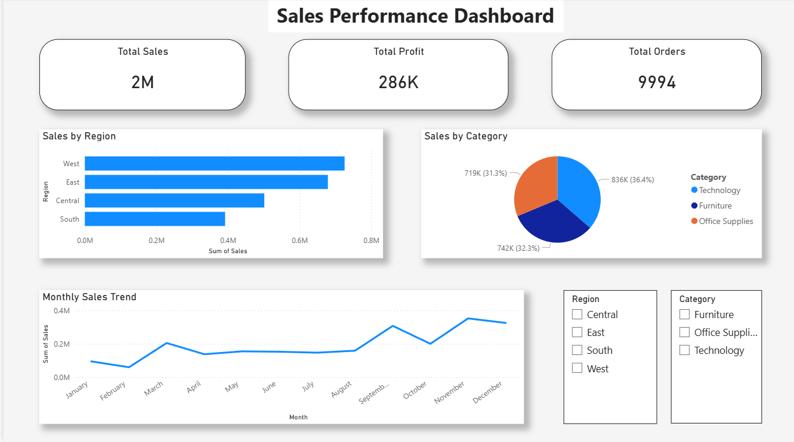

# 📊 Sales Performance Dashboard using Power BI

## 📌 Project Overview

This project presents an **interactive Sales Performance Dashboard built using Power BI** to analyze business sales data and identify key insights such as revenue trends, regional performance, and product category analysis.

The dashboard transforms raw sales data into **clear visualizations and business insights** to support data-driven decision-making.

---

## 🛠 Tools & Technologies

* **Power BI** – Dashboard development and interactive visualization
* **Microsoft Excel** – Data cleaning and preprocessing
* **Data Visualization Techniques** – KPI cards, charts, slicers, and filters

---

## 📊 Dashboard Preview



---

## 📂 Dataset

The dataset contains transactional sales information including:

* Order Date
* Region
* Product Category
* Sales Amount
* Profit
* Quantity

The dataset was cleaned and prepared before importing into Power BI for visualization and analysis.

---

## 📊 Dashboard Features

### Key Performance Indicators (KPIs)

* Total Sales
* Total Profit
* Total Orders
* Profit Margin

### Visualizations Included

* Sales by Region
* Sales by Product Category
* Monthly Sales Trend
* Top Performing Products
* Interactive Filters and Slicers

These visualizations enable users to explore sales data across multiple dimensions.

---

## 🔎 Key Insights

* Identified **top-performing product categories contributing to revenue growth**
* Analyzed **regional sales distribution across different markets**
* Observed **monthly sales trends and seasonal patterns**
* Highlighted **high-profit products and revenue-driving segments**

---

## 📁 Project Structure

```
sales-performance-dashboard-powerbi
│
├── sales_dashboard.pbix
├── sales_data.xlsx
├── dashboard_preview.png
└── README.md
```

---

## 🚀 Future Improvements

* Add **customer segmentation analysis using Python**
* Connect **SQL database for automated data refresh**
* Expand dashboard with **customer and profit analytics**

---

## 👤 Author

**Vishal Raj**

Data Analytics & AI/ML Enthusiast
Python | Power BI | Machine Learning | Data Analysis

LinkedIn:
https://linkedin.com/in/vishal-raj-855326240

